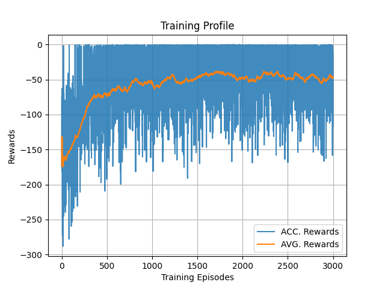
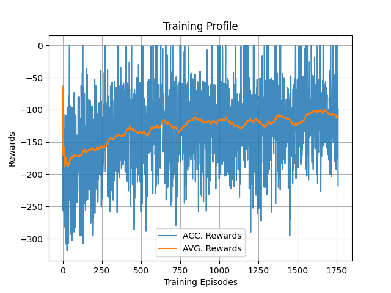

# Robotics Lab Project 2021-22

This repository holds the project files of 'Practical Course Robotics: WS21-22'.

## Proof of Concept

1. OpenAI Gym Environments,

    * 'FetchReach-v1': The best agent is DDPG.
        <p align="left">
            
        </p>

## Repository Setup Instructions

1. Clone & build [rai-python](https://github.com/MarcToussaint/rai-python) from the github following it's installation instructions.

2. Clone this repository.

    ```bash
    git clone https://github.com/KanishkNavale/robotics-lab-project
    ```

3. Add these in the .bashrc file

    ```bash
    # Misc. Alias
    alias python='python3'
    alias pip='pip3'

    # RAI Paths
    export PATH="$HOME/rai-python/rai/bin:$PATH"
    export PYTHONPATH="${PYTHONPATH}:$HOME/rai-python/build"

    # Practical Robotics Lab Project Package
    export PYTHONPATH="${PYTHONPATH}:$HOME/robotics-lab-project/"
    ```

4. Source the modified .bashrc file

    ```bash
    source ~/.bashrc
    ```

5. Install python package prequisites

    ```bash
    cd $HOME/robotics-lab-project
    pip install -r requirements.txt
    ```

## Project Progress

1. December 13, 2021

    * Tested DDPG & TD3 agent with RAI-gym
    * Task: Actuate Joints to reach a task space goal position.
    * Training Profile,
        |DDPG|TD3|
        |:--:|:--:|
        || |

    * Analysis
        * DDPG is better than TD3.
        * Use Priority Experience Replay Buffer (addressed as PER from now on).
        * May be, use a different agent as J7 joint is not that active.

2. December 14, 2021

    * Tested DDPG & TD3 agent with RAI-gym embedding expert action lookups.
    * Training Profile (Clipped x-range for better visibility),
        |DDPG|TD3|
        |:--:|:--:|
        || |

    * Analysis
        * DDPG is selected for further implementation. As the training moving average of rewards reached -17.
        * Upgrade DDPG -> DP4G with PER.
        * Come up with the good sampling of goals. Sometimes, goal is placed in the robot or at an extremes of the workspace.

## Developers

* Olga Klimashevska
* Kanishk Navale
