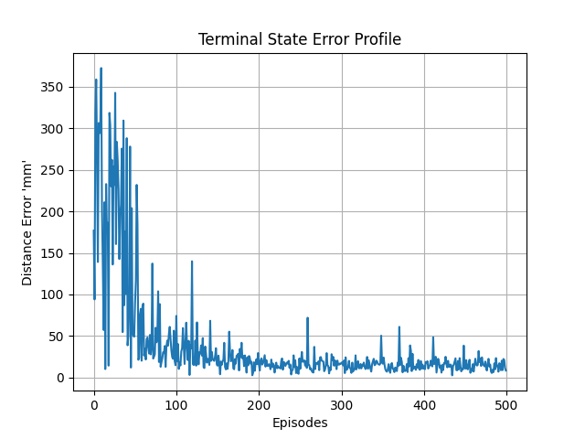

# Object Sorting using Deep Reinforcement Learning based Robot & Computer Vision

This repository holds the project files of 'Practical Course Robotics: WS21-22' presented at Universität Stuttgart.

    * The idea is to use deep reinforcement learning (DRL) algorithm for robot object tending.
    * For Proof of Concept, DRL algorithm's are benchmarked on openai-gym's 'FetchReach-v1' environment.
    * DDPG is the best agent against PPO & TD3, considering the training rewards as a metric.
    * New 'gym' wrapped 'rai' environment (env.) is designed using 'SolidWorks'.
    * As solving the env. directly takes >4M episodes, the task is broken in parts to solve it faster.
    * Wrapped functions are used to solve tasks.
    * One of these functions is moving the robot point-to-point using the trained agent.
    * Camera is used to build up object tending strategy to map the coloured objects to its coloured bin.
    * This strategy is processed to tend the object in env. using the robot.

### Proof of Concept

1. OpenAI Gym Environments,

    * 'FetchReach-v1': The best agent is DDPG.
        |||
        |:--:|:--:|
        || |

    * DDPG Agent is benchmarked for training rewards with PPO and TD3 Agents.

### Repository Setup Instructions

1. Clone & build [rai](https://github.com/MarcToussaint/rai) from the github following it's installation instructions.

2. Clone this repository.

    ```bash
    git clone --recursive https://github.com/KanishkNavale/robotics-lab-project
    ```

3. Add these in the .bashrc file

    ```bash
    # Misc. Alias
    alias python='python3'
    alias pip='pip3'

    # RAI Paths
    export PATH="$HOME/rai/bin:$PATH"
    export PYTHONPATH="${PYTHONPATH}:/usr/local/lib/rai"

    # Practical Robotics Lab Project Package
    export PYTHONPATH="${PYTHONPATH}:$HOME/robotics-lab-project/"
    ```

4. Source the modified .bashrc file

    ```bash
    source ~/.bashrc
    ```

5. Install python package prequisites

    ```bash
    cd $HOME/robotics-lab-project
    pip install -r requirements.txt
    ```

### 1. Engineering the Deep Deterministic Policy Gradient ([DDPG](https://arxiv.org/abs/1509.02971)) Algorithm

About: The Deep Deterministic Policy Gradient (DDPG) agent is an off policy algorithm and can be thought of as DQN for continuous action spaces. It learns a policy (the actor) and a Q-function (the critic). The policy is deterministic and its parameters are updated based on applying the chain rule to the Q-function learnt (expected reward). The Q-function is updated based on the Bellman equation, as in Q learning. ([Source & Further Reading](https://keras-rl.readthedocs.io/en/latest/agents/ddpg/))

|Vanilla DDPG Agent|DDPG Agent + Parametric Exploration Noise + PER|
|:--:|:--:|
|||

### 2. Outcomes: Using Prioritized Experience Replay Buffer + Parametric Exploration Noise

* Parameter space noise allows reinforcement learning algorithms to explore by perturbing parameters instead of actions, often leading to significantly improved exploration performance. ([Source](https://openreview.net/forum?id=ByBAl2eAZ))

* Prioritized Experience Replay (PER) is a type of experience replay in reinforcement learning frequently replay transitions with high expected learning progress are learnt more, as measured by the magnitude of their temporal-difference (TD) error. ([Source](https://paperswithcode.com/method/prioritized-experience-replay#:~:text=Prioritized%20Experience%20Replay%20is%20a,%2Ddifference%20(TD)%20error.))

|Without|Parametric Noise Overview|With PER + Parametric Noise
|:--:|:--:|:--:|
|| ||

* Result: The DDPG Agent is 5 times better (metric: training rewards) with PER & Parametric Exploration.

### 3. Training DDPG Agent for Point-to-Point Robot Trajectory


|Training Profile|Testing Profile|
|:--:|:--:|
|| |

* The objective is to reach the random target position using DDPG Agent.
* For each play step in a game,
  * Build: state = Current Robot TCP(x, y, z) | Target Location P(x, y, z)
  * Compute: action = actor.choose_noisy_action(state)
  * Get: next_state, reward, done = env.step(action)
* DDPG Agent is optimized to maximize the reward for each play step over the games.

### 4. Vision based Pose Detection


* Object Pose is computed by processing point cloud and RGB data.

### 5. Logging the Process Data

* The object data is saved in .json format and processed image too.

    ```json
    [
        {
            "Object ID": 0,
            "Camera Coordinates [u, v]": [
                320,
                169
            ],
            "World Coordinates [x, y, z]": [
                -0.0022170670613970446,
                -0.00854486748731096,
                1.0097603467432426
            ],
            "Color": "red"
        },
        {
            "Object ID": 1,
            "Camera Coordinates [u, v]": [
                306,
                179
            ],
            "World Coordinates [x, y, z]": [
                0.04528890767445167,
                0.02470116320227714,
                1.0080491988625047
            ],
            "Color": "blue"
        }
    ]
    ```

### 5. Object Sorting Process


* The processed data is dumped in the [folder](main/data)

### 6. Runnnig the App

```bash
    cd main
    python main.py
```

### Developers

* Olga Klimashevska
* Kanishk Navale,
  * Email: <navalekanishk@gmail.com>
  * Website: <https://kanishknavale.github.io/>
