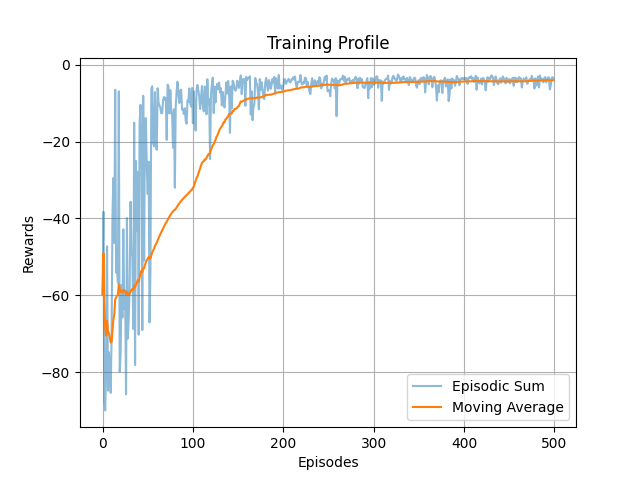

# Object Sorting using Deep Reinforcement Learning based Robot & Computer Vision

This repository holds the project files of 'Practical Course Robotics: WS21-22'.

### Proof of Concept

1. OpenAI Gym Environments,

    * 'FetchReach-v1': The best agent is DDPG.
        |||
        |:--:|:--:|
        || |

### Repository Setup Instructions

1. Clone & build [rai](https://github.com/MarcToussaint/rai) from the github following it's installation instructions.

2. Clone this repository.

    ```bash
    git clone --recursive https://github.com/KanishkNavale/robotics-lab-project
    ```

3. Add these in the .bashrc file

    ```bash
    # Misc. Alias
    alias python='python3'
    alias pip='pip3'

    # RAI Paths
    export PATH="$HOME/rai/bin:$PATH"
    export PYTHONPATH="${PYTHONPATH}:/usr/local/lib/rai"

    # Practical Robotics Lab Project Package
    export PYTHONPATH="${PYTHONPATH}:$HOME/robotics-lab-project/"
    ```

4. Source the modified .bashrc file

    ```bash
    source ~/.bashrc
    ```

5. Install python package prequisites

    ```bash
    cd $HOME/robotics-lab-project
    pip install -r requirements.txt
    ```

### 1. Engineering the Deep Deterministic Policy Gradient ([DDPG](https://arxiv.org/abs/1509.02971)) Algorithm

About: The Deep Deterministic Policy Gradient (DDPG) agent is an off policy algorithm and can be thought of as DQN for continuous action spaces. It learns a policy (the actor) and a Q-function (the critic). The policy is deterministic and its parameters are updated based on applying the chain rule to the Q-function learnt (expected reward). The Q-function is updated based on the Bellman equation, as in Q learning. ([Source & Further Reading](https://keras-rl.readthedocs.io/en/latest/agents/ddpg/))

|Vanilla DDPG Agent|
|:--:|
||
|DDPG Agent + Parametric Exploration Noise + PER|
||

### 2. Outcomes of using Prioritized Experience Replay Buffer (PER) + Parametric Exploration Noise

|Without|Parametric Noise Overview|With PER + Parametric Noise
|:--:|:--:|:--:|
|| ||

* Parameter space noise allows reinforcement learning algorithms to explore by perturbing parameters instead of actions, often leading to significantly improved exploration performance. ([Source](https://openreview.net/forum?id=ByBAl2eAZ))

* Prioritized Experience Replay is a type of experience replay in reinforcement learning frequently replay transitions with high expected learning progress are learnt more, as measured by the magnitude of their temporal-difference (TD) error. ([Source](https://paperswithcode.com/method/prioritized-experience-replay#:~:text=Prioritized%20Experience%20Replay%20is%20a,%2Ddifference%20(TD)%20error.))

### 3. Training DDPG Agent for Point-to-Point Robot Trajectory


|Training Profile|Testing Profile|
|:--:|:--:|
|| |

### Developers

* Olga Klimashevska
* Kanishk Navale
