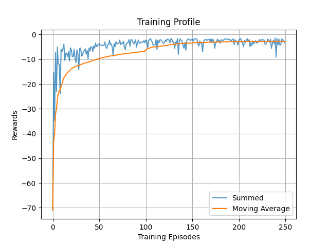
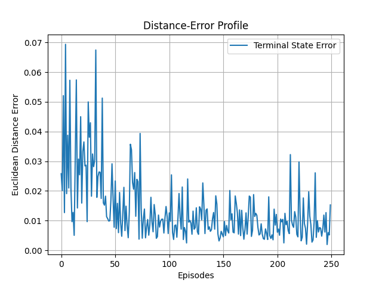

1. December 13, 2021

    * Tested DDPG & TD3 agent with RAI-gym
    * Task: Actuate Joints to reach a task space goal position.
    * Training Profile,
        |DDPG|TD3|
        |:--:|:--:|
        || |

    * Analysis
        * DDPG is better than TD3.
        * Use Priority Experience Replay Buffer (addressed as PER from now on).
        * May be, use a different agent as J7 joint is not that active.

2. December 14, 2021

    * Tested DDPG & TD3 agent with RAI-gym embedding expert action lookups.
    * Training Profile (Clipped x-range for better visibility),
        |DDPG|TD3|
        |:--:|:--:|
        || |

    * Analysis
        * DDPG is selected for further implementation. As the training moving average of rewards reached -17 w.r.t. expert's action.
        * Upgrade DDPG -> DP4G with PER.
        * Come up with the good sampling of goals. Sometimes, goal is placed in the robot or at an extremes of the workspace.

3. December 19, 2021

    * OUNoise does not improve exploration.

    * Running env. with veolicty control signals has a hard time converging.

4. December 21, 2021

    * Tested DDPG with Prioritized Experience Replay & Parametric Noise.
    * Training Log,
        |Training Profile|Distance Error|
        |:--:|:--:|
        || |

5. December 26, 2021

    * Designed a robot scene with SolidWorks and exported the '.urdf' files into the environment.
    * Have an issue to reach position on the table top as the actor's activation function is limited to [-1.0, 1.0].
    * Normalization of states and Denormalization is required.
    * Reach Issue,

        

6. December 28, 2021

    * Switched to Relative Frames instead of normalizing the states.
    * Moved the agent optimization to be called inside the episode rollout.
    * Training Log,
        |Training Profile|Distance Error|
        |:--:|:--:|
        || |